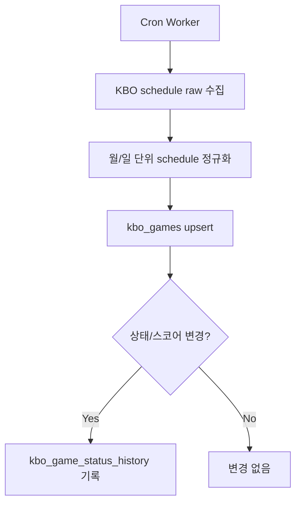
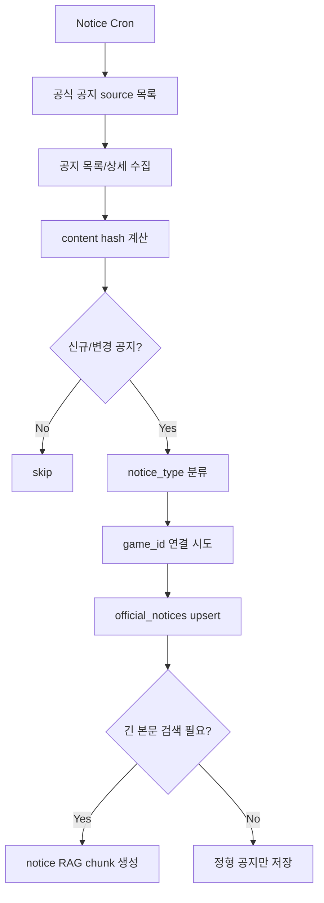
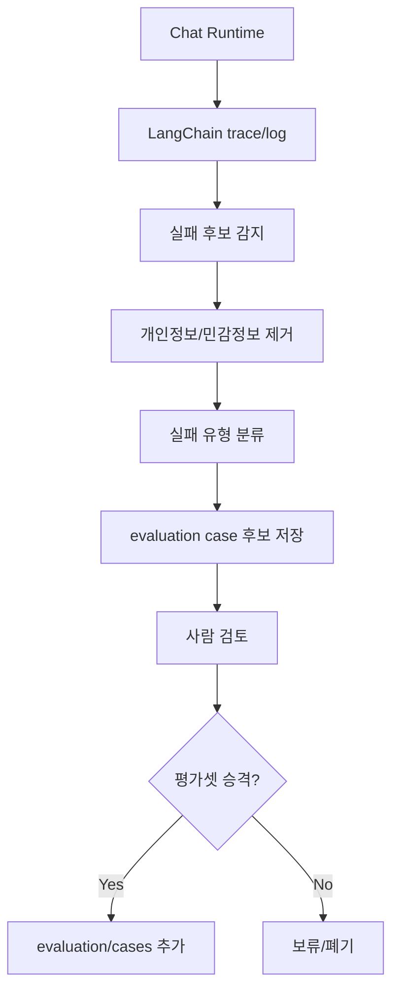

# Operational Data Update Pipeline Plan v1-1

> 라벨: `MVP2`  
> 작성일: 2026-08-10  
> 대상 영역: KBO 일정/상태, 경기 당일 공식 공지, 향후 채팅 실패 케이스 수집  
> 목적: RAG 자동 학습이 아닌 검증 가능한 데이터 최신화와 품질 개선 루프를 정의  
> 상태: 계획 유지

## 1. 배경

현재 backend RAG 데이터는 사용자가 채팅할수록 자동으로 학습되는 구조가 아니다.

현재 신규 데이터 갱신의 핵심은 KBO 경기 일정을 cron으로 수집하고 DB에 upsert하는 방식이다. 이 문서는 그 외에 우선 구축할 데이터 업데이트 파이프라인과, LangChain 적용 이후 도입할 채팅 실패 케이스 수집 파이프라인을 정리한다.

## 2. 우선순위

```text
필수:
1. 경기 일정/상태 cron 업데이트
2. 경기 당일 공식 공지 수집

현재 보류:
3. 구장 안내 RAG 자동 갱신
4. 야구 규칙/리그 규정 시즌 갱신

LangChain 적용 이후:
5. 채팅 실패 케이스 수집과 evaluation case 후보화
```

## 3. 원칙

- 정형 데이터는 DB table에 upsert한다.
- 긴 공식 문서와 공지 본문은 필요할 때만 RAG chunk로 만든다.
- 사용자 채팅 전문을 그대로 저장하거나 RAG에 넣지 않는다.
- 채팅 로그는 자동 학습 데이터가 아니라 실패 분석과 평가셋 개선 신호로만 사용한다.
- 모든 수집 데이터는 가능한 한 `raw -> normalized -> upsert/embedding -> evaluation` 흐름을 따른다.
- 공식 출처 URL, 수집 시점, content hash, review status를 남긴다.
- 실제 사용자 개인정보, API key, Authorization header, 쿠키 값은 저장하지 않는다.

## 4. Pipeline 1: 경기 일정/상태 Cron

### 4.1 목표

KBO 경기 일정, 경기 상태, 스코어, 취소/연기 여부를 주기적으로 최신화한다.

이 데이터는 RAG가 아니라 정형 DB 조회 대상이다. Agent는 사용자의 일정/상태 질문에 대해 `find_kbo_game` 같은 tool을 통해 DB를 조회한다.

### 4.2 처리 흐름



### 4.3 초기 정책

```text
Asia/Seoul 기준 오늘 날짜 확인
오늘이 속한 월의 KBO 일정 재수집
오늘 경기만 정규화
기존 kbo_games upsert 로직 재사용
상태/스코어 변경 시 kbo_game_status_history 기록
```

초기 실행 주기:

```text
매 1시간마다 당일 경기 상태 업데이트
```

경기 시작 전후에는 더 촘촘한 주기를 고려할 수 있다.

```text
경기 없는 날: 3~6시간 간격
경기 당일 낮: 1시간 간격
경기 시작 2시간 전~종료 후: 10~30분 간격
```

### 4.4 예시

```text
사용자 질문:
"오늘 사직 경기 몇 시야?"

처리:
find_kbo_game이 kbo_games에서 오늘 사직 경기 조회
game_status=scheduled, start_time=18:30 반환

cron 이후 변경:
KBO 원본에서 rainout 상태 확인
kbo_games.game_status=cancelled upsert
kbo_game_status_history에 scheduled -> cancelled 기록

이후 사용자 질문:
"오늘 사직 경기 취소야?"

응답:
DB 기준으로 취소 상태를 반환하고, 필요하면 공식 공지 tool과 함께 확인
```

## 5. Pipeline 2: 경기 당일 공식 공지 수집

### 5.1 목표

경기 일정 DB만으로 답하기 어려운 경기 당일 운영 정보를 공식 출처에서 수집한다.

대상 예시는 다음과 같다.

```text
우천 취소/경기 개시 지연 공지
입장 시간 변경
특정 경기 예매/매진/환불 안내
이벤트/프로모션
응원석/좌석 운영 변경
교통/주차/셔틀 임시 안내
구장 안전/반입 관련 당일 공지
```

### 5.2 저장 대상

초기에는 정형 table 중심으로 저장하고, 본문이 길거나 검색 근거가 필요할 때만 RAG chunk로 확장한다.

예상 table:

```text
official_notices
```

예상 필드:

```json
{
  "notice_id": "LG_20260810_jamsil_rain_delay",
  "team_id": "LG",
  "stadium_id": "JAMSIL",
  "game_id": "nullable",
  "notice_type": "weather_delay",
  "title": "8월 10일 잠실 경기 개시 지연 안내",
  "url": "https://official.example/notice/...",
  "published_at": "2026-08-10T15:20:00+09:00",
  "summary": "우천으로 경기 개시가 지연됨",
  "raw_content_hash": "sha256...",
  "review_status": "auto_collected",
  "expires_at": "2026-08-11T00:00:00+09:00"
}
```

### 5.3 처리 흐름



### 5.4 Agent 사용 방식

경기 상태 질문은 일정 DB와 공식 공지를 함께 확인하는 것이 좋다.

```text
사용자 질문:
"오늘 잠실 경기 비 오면 취소야?"

권장 tool 순서:
1. find_kbo_game
2. get_weather
3. search_official_notice

답변 정책:
공식 취소 공지가 없으면 취소 확정처럼 말하지 않는다.
날씨 정보는 가능성 설명에만 사용한다.
취소/연기/지연은 공식 공지 또는 KBO 일정 상태를 우선한다.
```

### 5.5 예시

```text
15:20 LG 공식 공지:
"잠실 경기 우천으로 개시 지연"

pipeline:
공지 상세 HTML 저장
notice_type=weather_delay
game_id=20260810_LG_HOME 연결
official_notices upsert

사용자 질문:
"오늘 잠실 경기 시작했어?"

응답:
kbo_games 상태와 official_notices의 지연 공지를 함께 반영
출처 URL을 함께 제공
```

## 6. 보류 Pipeline: 구장 안내 RAG 자동 갱신

현재는 필요도가 낮으므로 자동화 우선순위에서 제외한다.

나중에 필요해지면 다음 흐름으로 확장한다.

```text
공식 구장/예매/교통 페이지 수집
이전 raw와 content hash 비교
변경된 문서만 normalized 재생성
review_status=needs_review
검수 후 verified
chunk 재생성
embedding upsert
retrieval evaluation 실행
```

## 7. 보류 Pipeline: 야구 규칙/리그 규정 시즌 갱신

현재는 필요도가 낮으므로 자동화 우선순위에서 제외한다.

나중에 시즌 변경 또는 규정 변경 시 다음 흐름으로 확장한다.

```text
신규 시즌 공식 PDF/웹페이지 확보
PDF 텍스트 추출
topic 단위 normalized 문서 생성
curated chunk 생성
embedding upsert
연도 metadata로 최신 규정 우선 검색
evaluation case 실행
```

## 8. LangChain 이후 Pipeline: 채팅 실패 케이스 수집

### 8.1 목표

채팅 실패를 자동 학습하지 않고, 사람이 검토 가능한 evaluation case 후보로 전환한다.

LangChain 적용 이후에 진행하는 이유는 agent input, tool call sequence, retrieval result, final answer, error, user feedback 같은 실행 흔적을 구조화해서 남기기 쉽기 때문이다.

### 8.2 수집 대상

```text
tool routing 실패
retrieval 실패
답변 근거 부족
답변 정책 위반
timeout/error
사용자 부정 피드백
반복 질문
```

### 8.3 저장하지 않을 것

```text
사용자 대화 전문
개인정보
인증 정보
쿠키/토큰
외부 API key
```

### 8.4 처리 흐름



### 8.5 실패 케이스 예시

Tool routing 실패:

```json
{
  "case_type": "tool_routing_failure",
  "user_intent": "weather_cancel_status",
  "sanitized_query": "오늘 사직 경기 비 오면 취소야?",
  "expected_tools": ["find_kbo_game", "search_official_notice", "get_weather"],
  "observed_tools": ["get_weather"],
  "failure_reason": "official_notice_tool_not_used",
  "created_from": "chat_feedback",
  "review_status": "needs_review"
}
```

Retrieval 실패:

```json
{
  "case_type": "rag_answer_failure",
  "user_intent": "stadium_seat_home_away_side",
  "sanitized_query": "잠실 1루가 LG 응원석이야?",
  "expected_domain": "stadium_guide",
  "failure_reason": "missing_or_low_confidence_retrieval",
  "created_from": "chat_trace",
  "review_status": "needs_review"
}
```

정책 실패:

```json
{
  "case_type": "answer_policy_failure",
  "user_intent": "game_cancel_confirmation",
  "sanitized_query": "오늘 잠실 경기 취소 확정이야?",
  "failure_reason": "answered_as_confirmed_without_official_notice",
  "expected_behavior": "공식 공지 또는 KBO 상태 없이는 취소 확정 답변 금지",
  "review_status": "needs_review"
}
```

### 8.6 Evaluation Case 승격 기준

```text
같은 intent가 반복적으로 발생한다.
현재 tool routing few-shot으로 커버되지 않는다.
RAG 데이터가 부족하거나 검색 품질이 낮다.
답변 정책이 명확하지 않아 오답 위험이 있다.
실패가 사용자 경험에 직접적인 영향을 준다.
```

승격 이후 조치:

```text
tool routing evaluation case 추가
RAG retrieval evaluation case 추가
답변 정책 문서 보강
프롬프트/few-shot 보강
필요 시 공식 데이터 source 추가
```

## 9. 단계별 로드맵

### Phase 1: 운영 데이터 최신화

```text
경기 일정/상태 cron 구현
경기 상태 변경 이력 저장
경기 당일 공식 공지 source 목록 정의
official_notices table 설계
공지 수집/upsert worker 구현
agent tool에서 일정 DB와 공식 공지를 함께 조회
```

### Phase 2: Agent/RAG 실행 구조 정리

```text
LangChain 적용
tool call trace 구조화
retrieval result logging 정리
answer/error/user feedback 관찰 가능성 확보
```

### Phase 3: 품질 개선 루프

```text
채팅 실패 후보 감지
민감정보 제거
실패 유형 분류
evaluation case 후보 저장
사람 검토 후 evaluation/cases 승격
프롬프트/툴 라우팅/RAG 데이터 보강
```

## 10. 열린 질문

- 공식 공지 source 목록을 팀별로 어디까지 포함할지 결정해야 한다.
- `official_notices`를 backend domain으로 둘지, script/worker 전용 모듈로 시작할지 결정해야 한다.
- 경기 시작 전후 cron 주기를 고정값으로 둘지, 경기 일정 기반 동적 주기로 둘지 결정해야 한다.
- LangChain trace 저장 위치와 보존 기간을 결정해야 한다.
- 실패 케이스 후보를 DB에 저장할지, `data/*/evaluation/candidates/` 파일로 먼저 관리할지 결정해야 한다.
