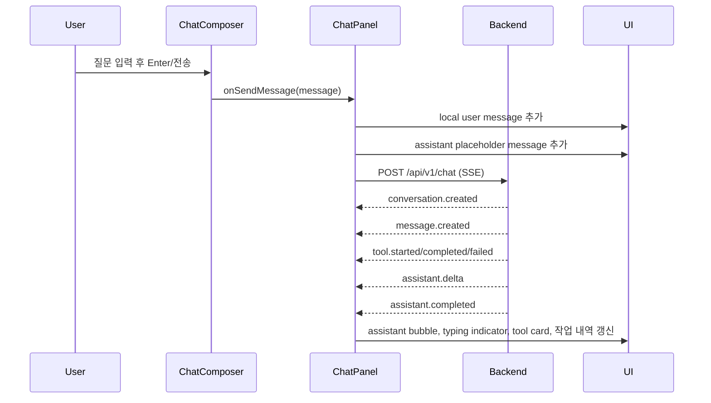

# Frontend Layout Spec

## 1. 목적

이 문서는 UI 개선 전에 현재 프론트엔드 레이아웃 기준선을 고정하고, 2026-08-12 인터뷰에서 결정한 다음 layout 개선 계획을 기록한다. 대상은 KBO 야구 도우미 채팅 앱의 첫 화면, 통합 사이드바, 채팅 워크스페이스, 출처 드로어, 모달, 채팅 입력 영역이다.

## 2. 현재 구현 범위

- [확인됨] 프론트엔드는 `frontend/`의 Next.js App Router 단일 페이지 앱이다. 라우트 진입점은 `frontend/src/app/page.tsx`이고 실제 화면은 `frontend/src/views/chat/ui/chat-page.tsx`가 조립한다.
- [확인됨] 현재 최상위 화면 구조는 `AppHeader`, `ChatSidebar`, `ChatPanel`, `SourceDrawer`, `LoginModal`, `ProfileModal`이다.
- [확인됨] 현재 구현된 전역 레이아웃은 fixed header, 접힘 가능한 좌측 sidebar, 중앙 채팅 패널, 우측 SourceDrawer 중심이다.
- [사용자 결정] 다음 layout 개선에서는 fixed `AppHeader`를 완전히 제거하고, 로고/브랜드/로그인/계정 진입점을 `ChatSidebar`로 통합한다.
- [사용자 결정] 사이드바 디자인은 Manus 캡처를 벤치마킹하되, 버튼과 기능 구성을 그대로 복제하지 않는다.
- [확인됨] 우측 출처 패널은 `SourceDrawer`로 존재하지만, 실제 출처 데이터와 연결되지 않은 빈 상태 안내 문구만 표시한다.
- [확인됨] 로그인/프로필은 Jotai atom으로 열고 닫는 모달 UI만 존재하며, 저장/인증 API 연동은 없다.
- [확인됨] 채팅 입력은 실제 `/api/v1/chat` SSE 스트림 호출과 연결되어 있다.
- [확인됨] tool 결과 렌더링은 `ToolResultCard`에서 completed 상태는 tool 이름별 카드 컴포넌트로 분기하고, running/failed 상태는 공통 `GenericToolCard`로 표시한다.

## 3. 비목표

- [확인됨] 현재 spec은 UI 개선 전 기준선 문서였으나, 2026-08-10 기준 1차 layout/UI 개선 결과를 반영해 갱신한다.
- [확인됨] 현재 MVP에는 팀/구장 네비게이션, 설정 페이지가 구현되어 있지 않다.
- [확인됨] 로그인과 프로필 입력은 로컬 UI만 존재하며 실제 인증, 저장, 서버 동기화는 구현되어 있지 않다.
- [확인됨] `ChatComposer`의 파일 추가, 음성 입력, 일정 검색/원정 조사/추천 근거 토글은 1차 UI에서 제거됐다.
- [확인됨] UI 개선 1차 범위의 좌측 사이드바는 구현됐고, 2026-08-12 기준 세션 데이터는 실제 `GET /api/v1/conversations` 목록 API와 연결됐다.
- [사용자 결정] 이번 2026-08-12 문서 업데이트 범위는 layout 개선 계획까지다. 실제 컴포넌트 구현은 별도 작업으로 진행한다.
- [사용자 결정] Manus의 `프로젝트` 섹션에 해당하는 별도 프로젝트/워크스페이스 기능은 이번 범위에 포함하지 않는다.

## 4. 사용자 흐름

1. 사용자는 `/`로 진입한다.
2. `RootLayout`이 styled-components registry와 app providers를 적용한다.
3. `Home`이 `ChatPage`를 렌더링한다.
4. 현재 구현에서는 사용자가 헤더에서 `프로필` 또는 `로그인` 모달을 열 수 있다.
5. 사용자는 hero 상태의 `ChatComposer`에 질문을 입력하고 전송한다.
6. 첫 메시지 전송 후 화면은 메시지 리스트 + 하단 composer dock 구조로 전환된다.
7. 프론트엔드는 guest id와 conversation id를 localStorage 기반으로 관리한다.
8. 프론트엔드는 `POST /api/v1/chat` SSE 스트림을 읽고 message/tool/assistant 이벤트를 화면 상태에 반영한다.
9. 사용자는 `출처 패널 열기` 버튼으로 우측 drawer를 열 수 있다.
10. [구현 계획] 개선 후 사용자는 사이드바 하단의 로그인/계정 바에서 로그인 모달 또는 계정 패널을 연다.

## 5. 화면/UI 스펙

### 5.1 App Shell

- [확인됨] `frontend/src/views/chat/ui/chat-page.tsx`
- 현재 구조:
  - `Shell`: `min-height: 100vh`
  - `AppHeader`
  - `Workspace`: `min-height: calc(100vh - 72px)`
  - `ChatSidebar`
  - `ChatPanel`
  - `SourceDrawer`
  - `LoginModal`
  - `ProfileModal`
- [확인됨] 헤더는 fixed top bar로 구현됐다.
- [확인됨] 헤더 높이 기준은 72px로 여러 컴포넌트에서 반복 사용한다.
- [사용자 결정] 다음 개선에서는 `AppHeader`를 제거한다.
- [구현 계획] 개선 후 최상위 구조는 `ChatSidebar`, `ChatPanel`, `SourceDrawer`, `LoginModal`, `ProfileModal` 중심으로 단순화한다.
- [구현 계획] `Shell`의 `padding-top: 72px`와 `Workspace`의 `calc(100vh - 72px)` 의존성을 제거한다.
- [구현 계획] desktop에서는 좌측 통합 sidebar가 전체 높이를 차지하고, main chat은 남은 영역을 사용한다.
- [구현 계획] mobile에서는 별도 상단 header를 두지 않고 floating menu button으로 off-canvas sidebar를 연다.

### 5.2 Header

- [확인됨] `frontend/src/widgets/app-header/ui/app-header.tsx`
- [확인됨] 좌측에는 `frontend/public/brand/flaming-baseball-logo.webp` 로고와 `KBO Mate`, `일정부터 예매까지, KBO 관람 도우미`가 표시된다.
- [확인됨] 우측에는 현재 비로그인 상태 기준 `로그인` 버튼이 표시된다.
- [확인됨] header는 fixed 처리되어 스크롤 시 상단에 유지된다.
- [사용자 결정] 다음 개선에서는 header를 완전히 제거한다.
- [사용자 결정] 기존 header의 로고/브랜드는 사이드바 상단으로 이동한다.
- [사용자 결정] 기존 header의 로그인/계정 진입점은 사이드바 하단으로 이동한다.
- [구현 계획] `AppHeader` 컴포넌트는 제거하거나 사용하지 않는 상태로 전환한다.
- [구현 계획] header 제거 후에도 로그인 모달, 프로필 모달, logout mutation 등 기존 인증 관련 동작은 사이드바 계정 영역에서 재사용한다.
- [확인 필요] 로그인 후 이름/별명과 프로필 이미지를 어디서 가져올지 결정해야 한다.
- [확인 필요] `마이페이지`를 별도 route로 만들지, modal/drawer로 열지 결정해야 한다.

### 5.3 Sidebar

- [확인됨] `frontend/src/widgets/chat-sidebar/ui/chat-sidebar.tsx`
- [확인됨] 사이드바는 ChatGPT 웹 버전과 유사하게 펼침/닫음 가능한 좌측 sidebar로 구현됐다.
- [확인됨] 사이드바 상단에는 새 채팅 버튼을 배치한다.
- [확인됨] 새 채팅 버튼 아래에는 채팅 목록 세션만 표시한다.
- [확인됨] 세션 목록은 `GET /api/v1/conversations?limit=50` 응답을 React Query로 조회한다.
- [확인됨] 세션 목록은 `@tanstack/react-virtual` 기반 virtualization을 사용한다.
- [확인됨] 사이드바가 닫힌 상태에서는 얇은 icon rail을 남긴다.
- [확인됨] collapsed icon rail에는 새 채팅 버튼과 사이드바 펼치기 버튼만 표시한다.
- [확인됨] 채팅 목록 세션 item은 대화 제목만 표시한다.
- [확인됨] 대화 제목은 1줄로 표시하고 overflow는 ellipsis 처리한다.
- [확인됨] 1차 범위에서 마지막 메시지 시각, 삭제/rename action, streaming/error 상태는 세션 item에 표시하지 않는다.
- [확인됨] active 세션은 배경색 강조와 굵은 글자로 표시한다.
- [확인됨] 세션 item hover 상태는 연한 배경으로 표시한다.
- [확인됨] 480px 이하에서는 floating hamburger와 off-canvas sidebar를 사용한다.
- [확인됨] mock 세션은 제거됐고 실제 conversation summary API와 연결됐다.
- [사용자 결정] 다음 개선의 사이드바는 Manus처럼 header와 sidebar가 통합된 단일 navigation surface로 만든다.
- [사용자 결정] 사이드바 상단 구성은 `브랜드 로고/이름`, `검색 아이콘`, `사이드바 접기 버튼`, `새 채팅`을 우선한다.
- [사용자 결정] 사이드바 주요 기능은 `새 채팅`, `채팅 목록`만 둔다.
- [사용자 결정] Manus의 `프로젝트` 섹션은 이번 1차 계획에서는 제외한다. 참고로 Manus 캡처의 `프로젝트` 영역은 첫 번째 이미지 중간의 `프로젝트` 제목과 `새 프로젝트` 버튼이 있는 섹션이다.
- [사용자 결정] 로그인/계정 바는 Manus처럼 사이드바 최하단에 고정한다.
- [사용자 결정] collapsed sidebar도 Manus처럼 로고/주요 아이콘/하단 아바타가 남는 얇은 rail 형태를 따른다.
- [구현 계획] expanded 상태 layout:
  - 상단 브랜드 row: KBO Mate 로고, 서비스명, 검색 icon button, 접기 icon button
  - primary action: `새 채팅`
  - main section: `채팅 목록`
  - bottom account bar: 비로그인 `로그인`, 로그인 후 avatar/nickname과 계정 메뉴
- [구현 계획] collapsed 상태 layout:
  - 좁은 rail 폭 유지
  - 로고 또는 앱 icon
  - `새 채팅`, `검색`, `사이드바 펼치기` icon button
  - 하단 login/avatar icon
- [구현 계획] mobile에서는 floating menu button으로 sidebar를 열고, 열린 sidebar는 off-canvas panel + scrim으로 표시한다.

### 5.4 Chat Hero State

- [확인됨] `frontend/src/widgets/chat/ui/chat-panel.tsx`
- [확인됨] 메시지가 없으면 hero 형태로 표시된다.
- 구성:
  - animated baseball logo
  - `KBO Agent` eyebrow
  - `오늘의 직관 판단을 한 번에 끝내세요` heading
  - 경기 일정, 구장 정보, 날씨, 좌석 추천, 예매 가이드 설명
  - `ChatComposer`
  - `출처 패널 열기`
- [확인됨] hero width는 `min(100%, 820px)`이다.

### 5.5 Chat Active State

- [확인됨] 메시지가 하나 이상 있으면 `ChatWorkspace`로 전환된다.
- 구조:
  - scrollable `MessageList`
  - 하단 `Dock`
  - dock 안의 `ChatComposer`
  - `출처 패널 열기`
  - 우측 하단 `작업 내역` 버튼과 activity panel
- [확인됨] active workspace width는 `min(100%, 920px)`이다.
- [확인됨] 메시지 리스트는 `aria-live="polite"`를 사용한다.
- [사용자 결정] 개선 후 채팅창 상단에는 현재 대화 제목/상태 바를 두는 안을 검토했으나, 2026-08-10 구현에서는 최신 user message 아래 inline status bar를 제거하고 assistant bubble 내부 상태 표현으로 흡수했다.
- [확인됨] 응답 상태는 기본 상태뿐 아니라 tool별 구체 상태도 내부 state로 관리한다.
- [확인됨] 진행 상태는 assistant bubble 안의 typing indicator, tool card, 우측 하단 작업 내역 패널로 표시한다.
- [확인됨] 응답 상태 문구는 다음 1차 문구를 사용한다.
  - idle: `준비됨`
  - streaming: `답변 작성 중`
  - failed: `응답 실패`
  - `find_kbo_game`: `경기 일정 확인 중`
  - `get_stadium_info`: `구장 정보 확인 중`
  - `get_weather_context`: `날씨 확인 중`
  - `search_stadium_guide`: `구장 가이드 검색 중`
  - `search_ticketing_guide`: `예매 정보 검색 중`
  - `search_baseball_knowledge`: `야구 지식 검색 중`
- [확인 필요] 긴 메시지 리스트 virtualization을 언제 도입할지 결정해야 한다. 의존성은 이미 `@tanstack/react-virtual`이 있다.

### 5.6 Chat Composer

- [확인됨] `frontend/src/features/send-message/ui/chat-composer.tsx`
- 입력:
  - text input
  - Enter 전송
  - disabled 상태에서는 전송 차단
- action:
  - 전송 icon button
- suggestion category:
  - 좌석 추천
  - 예매 안내
  - 날씨 판단
- [확인됨] category 선택 시 질문 예시 목록이 펼쳐지고, 클릭하면 input에 채워진다.
- [확인됨] 1차 composer 범위는 `입력창`, `전송 버튼`, `질문 예시`만 포함한다.
- [확인됨] `일정 검색`, `원정 조사`, `추천 근거` 모드 토글은 제거됐다.
- [확인됨] `직관 자료 추가`와 음성 입력 버튼은 제거됐다.
- [확인됨] 질문 예시는 첫 화면(hero/empty state)에서만 표시한다.
- [확인됨] 대화가 시작된 active chat 상태에서는 composer에 질문 예시를 표시하지 않는다.

### 5.7 Message Bubble

- [확인됨] `frontend/src/entities/message/ui/message-bubble.tsx`
- [확인됨] user message는 오른쪽 정렬, primary border, 연녹색 배경이다.
- [확인됨] assistant message는 왼쪽 정렬, panel 배경이다.
- [확인됨] tool result가 있으면 message body 아래 `ToolResultCard` 목록으로 렌더링한다.
- [확인됨] assistant content가 비어 있고 streaming 중이면 assistant bubble 안에 점 3개 typing indicator를 표시한다.
- [확인됨] content, tool result, typing indicator가 모두 없으면 빈 assistant bubble을 렌더링하지 않는다.
- [사용자 결정] assistant 응답의 상세 출처/주의사항은 SourceDrawer에서 모아 보여주고, 메시지 본문과 tool card는 핵심 흐름과 요약을 우선한다.

### 5.8 Tool Result Cards

- [확인됨] `frontend/src/entities/tool-result/ui/tool-result-card.tsx`
- [확인됨] tool name별 분기:
  - `find_kbo_game`
  - `get_stadium_info`
  - `get_weather_context`
  - `search_stadium_guide`
  - `search_ticketing_guide`
  - `search_baseball_knowledge`
  - fallback `GenericToolCard`
- [확인됨] running/failed status는 `GenericToolCard`로 표시한다.
- [확인됨] completed status는 tool 이름별 카드 컴포넌트로 표시한다.
- [사용자 결정] tool result card는 답변 흐름 안에서 핵심 결과 요약을 보여주는 역할로 둔다.
- [사용자 결정] 상세 출처, 기준 시점, 한계, 원문 링크 모아보기는 SourceDrawer가 담당한다.
- [사용자 결정] completed tool card에는 핵심 결과 요약을 표시한다.
- [사용자 결정] completed tool card에는 `툴 이름`, `완료 상태`, `핵심 결과 1~3줄`을 표시한다.
- [사용자 결정] 상세한 출처, 기준 시점, 한계, 원문 링크는 completed tool card가 아니라 SourceDrawer에서 확인하게 한다.
- [제안 후 승인] failed tool card에는 재시도 버튼을 넣지 않는다.
- [제안 후 승인] failed tool card에는 실패 상태와 짧은 사용자 친화적 메시지만 표시한다.
- [사용자 결정] tool card 공통 구조는 `헤더 + 본문`으로 한다.
- [사용자 결정] tool card 헤더에는 tool label과 status badge를 표시한다.
- [사용자 결정] tool card 본문은 상태별로 다르게 표시한다.
  - running: 상태 문구 + 로딩 표시
  - completed: 핵심 요약 1~3줄
  - failed: 짧은 실패 메시지
- [확인됨] tool card 공통 shell은 상태별 accent line, icon tile, status badge, 본문 grid 스타일을 사용한다.

### 5.8.1 작업 내역 패널

- [확인됨] `ChatPanel` 우측 하단에 `작업 내역` 버튼을 표시한다.
- [확인됨] tool result가 있거나 streaming/error 상태일 때 버튼에 dot indicator를 표시한다.
- [확인됨] 버튼을 누르면 activity panel을 열고 tool name과 running/completed/failed 상태를 보여준다.
- [확인됨] activity panel은 tool 상세 결과가 아니라 진행 내역 요약만 담당한다.
- [확인 필요] 모바일 composer와 작업 내역 버튼의 겹침 여부를 추가 QA해야 한다.

### 5.9 Source Drawer

- [확인됨] `frontend/src/widgets/source-drawer/ui/source-drawer.tsx`
- [확인됨] Jotai `isSourceDrawerOpenAtom`으로 열고 닫는다.
- [확인됨] 열린 상태에서 fixed right drawer로 표시된다.
- [확인됨] 위치는 `top: 72px`, `right: 0`, `bottom: 0`, width `min(100vw, 360px)`이다.
- [확인됨] 현재 내용은 빈 상태 안내뿐이다.
- [사용자 결정] SourceDrawer는 1차 UI 개선에서 실제 출처/근거 패널로 살린다.
- [사용자 결정] SourceDrawer는 사용된 출처, 원문 링크, 주의/참고를 모아 보여준다.
- [사용자 결정] SourceDrawer 1차 데이터는 단순하게 유지한다.
- [사용자 결정] SourceDrawer에는 `출처 제목`, `원문 링크`, `주의/참고`를 표시한다.
- [사용자 결정] `주의/참고`는 딱딱한 한계 고지가 아니라 부드러운 어투와 당구장 표시 같은 시각 표현으로 처리한다.
- [사용자 결정] 출처 유형, 관련 tool 이름, 기준 시점, trust level은 1차 범위에서 제외하고 추후 확장 후보로 둔다.
- [사용자 결정] header 제거 후 desktop SourceDrawer는 `top: 0`, `right: 0`, `bottom: 0` 기준으로 전체 높이를 사용한다.
- [사용자 결정] mobile SourceDrawer는 full-screen drawer 또는 bottom sheet 계열로 전환한다.
- [구현 계획] `SourceDrawer`의 `top: 72px` 의존성을 제거하고 통합 sidebar와 겹치지 않는 z-index/overlay 규칙을 다시 정한다.

### 5.10 Login/Profile Modal

- [확인됨] `frontend/src/features/auth/ui/login-modal.tsx`
- [확인됨] `frontend/src/features/profile/ui/profile-modal.tsx`
- [확인됨] 공통 modal은 `frontend/src/shared/ui/modal/modal.tsx`를 사용한다.
- [확인됨] overlay click과 닫기 버튼으로 닫힌다.
- [확인됨] focus trap, Escape close, submit handling, validation은 구현되어 있지 않다.
- [사용자 결정] 로그인 기능은 곧 실제 기능으로 붙일 예정이다.
- [사용자 결정] 1차 UI는 실제 로그인 기능이 연결될 것을 전제로 사이드바 하단의 비로그인/로그인 상태를 설계한다.
- [사용자 결정] 로그인 후에는 사이드바 하단에 이름 또는 별명과 원형 프로필을 표시한다.
- [사용자 결정] 계정 dropdown/panel은 Manus처럼 큰 패널 형태를 따른다.
- [사용자 결정] 계정 dropdown/panel에는 일단 `마이페이지`, `로그아웃`을 표시한다.
- [구현 계획] 현재 `AppHeader`에 있는 `useCurrentUser`, `useLogout`, `isLoginModalOpenAtom`, `isProfileModalOpenAtom` 사용 흐름을 사이드바 하단 account bar로 이동한다.
- [확인 필요] 실제 auth 연동 방식과 provider를 결정해야 한다.
- [사용자 결정] 로그인 화면은 별도 route가 아니라 modal로 유지한다.

## 6. API 계약

### 6.1 Chat Stream

- [확인됨] `frontend/src/features/chat-stream/api/stream-chat-message.ts`
- Method: `POST`
- Path: `${NEXT_PUBLIC_API_BASE_URL ?? "http://127.0.0.1:4000"}/api/v1/chat`
- Headers:
  - `Accept: text/event-stream`
  - `Content-Type: application/json`
- Request body:

```json
{
  "guest_id": "string",
  "conversation_id": "string | null",
  "message": "string"
}
```

- [확인됨] SSE event 종류:
  - `conversation.created`
  - `message.created`
  - `tool.started`
  - `tool.completed`
  - `tool.failed`
  - `assistant.delta`
  - `assistant.completed`
  - `conversation.updated`
  - `stream.failed`
  - `done`
- [확인됨] Zod로 SSE payload를 검증하고 camelCase UI 타입으로 변환한다.
- [확인됨] 2026-08-10 기준 `ChatComposer`에는 message만 전송하며, 제거된 mode toggle/upload file/voice input 상태는 request body에 포함되지 않는다.

### 6.2 Conversation List

- [확인됨] `frontend/src/features/conversation-list/api/list-conversations.ts`
- Method: `GET`
- Path: `${NEXT_PUBLIC_API_BASE_URL ?? "http://127.0.0.1:4000"}/api/v1/conversations?limit=50`
- [확인됨] 인증된 사용자의 `user_profile_id`에 속한 대화방 목록을 최근 메시지 순으로 반환한다.
- [확인됨] 401 응답은 프론트에서 빈 목록으로 처리한다.
- Response body:

```json
{
  "conversations": [
    {
      "id": "string",
      "user_id": "string | null",
      "user_profile_id": "string | null",
      "guest_id": "string | null",
      "title": "string | null",
      "status": "active | archived | deleted",
      "agent_type": "string",
      "summary": "string | null",
      "metadata": {},
      "last_message_at": "string | null",
      "created_at": "string",
      "updated_at": "string",
      "deleted_at": "string | null"
    }
  ],
  "limit": 50,
  "offset": 0
}
```

## 7. 데이터 모델과 상태

- [확인됨] UI local state:
  - `messages`
  - `conversationId`
  - `responseStatus`
  - `isStreaming`
  - `errorMessage`
  - `failedRequestMessage`
  - `isActivityOpen`
  - `activeAssistantMessageId`
  - composer input atom
  - login/profile/source drawer open atom
- [확인됨] localStorage 기반 guest/conversation 관리:
  - `frontend/src/features/chat-stream/model/guest-session.ts`
- [확인됨] React Query provider는 존재하지만 현재 채팅 스트림 상태는 component local state 중심이다.
- [확인됨] 대화 목록은 React Query `conversationListQueryKey`로 관리한다.
- [확인됨] `conversation.updated` 또는 `done` SSE 이벤트를 받으면 대화 목록 query를 invalidate한다.
- [확인 필요] 완료된 대화/메시지를 React Query cache 또는 server state로 승격할지 결정해야 한다.

## 8. 처리 흐름



## 9. 엣지 케이스와 실패 시나리오

- [확인됨] streaming 중에는 추가 전송을 무시한다.
- [확인됨] component unmount 시 active `AbortController`를 abort한다.
- [확인됨] fetch 실패 시 error message를 표시하고 fallback assistant message를 추가한다.
- [확인됨] 전체 응답 실패 시 메시지 영역에 inline error block과 `다시 시도` 버튼을 표시한다.
- [확인됨] 빈 assistant placeholder는 content/tool/typing이 없으면 렌더링하지 않는다.
- [확인됨] SSE event name이 unknown이거나 data가 없으면 무시한다.
- [확인됨] SSE payload JSON parse/Zod parse 실패는 catch되어 error fallback으로 이어진다.
- [확인 필요] 모바일에서 drawer가 열린 상태의 background scroll/overlay 처리가 필요하다.
- [확인 필요] modal focus trap과 Escape close가 필요하다.
- [확인 필요] composer input이 길어질 때 textarea 전환 또는 multi-line 입력을 지원할지 결정해야 한다.

## 10. SSE 로딩 UX

SSE 채팅의 로딩 처리는 이 UI의 핵심 경험으로 보고, assistant bubble 내부와 작업 내역 패널에서 진행 상태를 표현한다.

### 10.1 전송 직후

- [사용자 결정] 사용자 메시지는 전송 즉시 채팅 목록에 추가한다.
- [확인됨] 사용자 메시지 전송 즉시 assistant placeholder message를 생성한다.
- [사용자 결정] 전송 후 응답이 완료될 때까지 composer는 disabled 처리한다.
- [확인됨] assistant content가 아직 없고 streaming 중이면 assistant bubble 안에 typing indicator를 표시한다.

### 10.2 Tool 실행 중

- [사용자 결정] tool 실행 상태는 채팅 메시지 안의 카드로도 보여준다.
- [사용자 결정] tool running card를 표시해 사용자가 어떤 정보를 확인 중인지 볼 수 있게 한다.
- [사용자 결정] tool card는 `running`, `completed`, `failed` 상태를 시각적으로 구분한다.
- [확인됨] tool별 상태는 우측 하단 작업 내역 패널에도 요약 표시한다.
- [사용자 결정] running tool card에는 `툴 이름`, `상태 문구`, `로딩 표시`만 보여준다.
- [사용자 결정] running tool card에는 stadium/date/time 같은 입력값 요약을 표시하지 않는다.
- [사용자 결정] 여러 tool이 실행될 때 tool card는 SSE 이벤트가 도착한 순서대로 쌓는다.
- 상태 문구 초안:
  - `find_kbo_game`: `경기 일정 확인 중`
  - `get_stadium_info`: `구장 정보 확인 중`
  - `get_weather_context`: `날씨 확인 중`
  - `search_stadium_guide`: `구장 가이드 검색 중`
  - `search_ticketing_guide`: `예매 정보 검색 중`
  - `search_baseball_knowledge`: `야구 지식 검색 중`
- [사용자 결정] 여러 tool이 연속 또는 병렬로 실행될 때 카드 정렬은 SSE 이벤트 도착 순서를 따르고, 대표 상태는 가장 최근 running tool을 우선한다.

### 10.3 Assistant 답변 생성 중

- [사용자 결정] assistant bubble은 SSE delta를 받아 실시간으로 누적 렌더링한다.
- [사용자 결정] assistant content가 아직 비어 있으면 typing indicator를 표시한다.
- [확인됨] 답변 생성 중 내부 상태 문구는 `답변 작성 중`을 사용한다.
- [사용자 결정] typing indicator는 점 3개 애니메이션으로 표시한다.

### 10.4 완료/실패

- [확인됨] 완료 시 내부 `responseStatus`는 `준비됨`으로 돌아간다.
- [확인됨] 실패 시 내부 `responseStatus`는 `응답 실패`로 표시한다.
- [사용자 결정] 실패 시 메시지 영역에 재시도 가능한 error block을 표시한다.
- [사용자 결정] 전체 응답 실패 error block에는 `다시 시도` 버튼을 표시한다.
- [사용자 결정] `다시 시도` 버튼은 마지막 사용자 메시지를 같은 conversation에 다시 전송한다.
- [사용자 결정] 1차 범위에서 실패한 tool만 개별 재실행하는 기능은 제공하지 않는다.

## 11. Toast UX

- [사용자 결정] 1차 UI에 toast 시스템을 포함한다.
- [확인 필요] 2026-08-10 기준 toast 시스템은 아직 구현되지 않았다.
- [제안 후 승인] 채팅 응답 실패처럼 사용자가 맥락 안에서 해결해야 하는 핵심 오류는 메시지 영역 inline error를 우선한다.
- [제안 후 승인] toast는 전역 보조 알림으로 사용한다.
- toast 사용 후보:
  - 로그인 필요
  - 프로필 저장 완료
  - 프로필 저장 실패
  - 새 채팅 생성
  - 대화 불러오기 실패
  - 다시 시도 시작
  - 네트워크 연결 문제
- [제안 후 승인] toast 위치는 desktop에서는 우하단으로 둔다.
- [제안 후 승인] mobile에서는 하단 composer와 겹치지 않도록 상단 중앙에 표시한다.
- [사용자 결정] toast 기본 지속 시간은 3초로 한다.
- [제안 후 승인] 실패/네트워크 toast도 기본 3초를 유지한다. 단, 채팅 핵심 오류는 inline error block이 남는다.

## 12. 테스트와 검증

- [확인됨] frontend scripts:
  - `pnpm lint`
  - `pnpm typecheck`
  - `pnpm build`
  - `pnpm dev`
- [확인됨] 개발 서버 기본 포트는 `next dev -p 3001`이다.
- [확인 필요] 현재 frontend 전용 테스트 파일은 확인되지 않았다.
- [확인 필요] UI 개선 후 최소 수동 검증 viewport:
  - desktop: 1440x900
  - tablet: 1024x768
  - mobile: 390x844

## 13. 로깅과 디버깅

- [확인됨] frontend 자체 API response logging은 없다.
- [확인됨] 백엔드에는 API 응답 JSON 파일 저장 미들웨어가 있다.
- [추론] 채팅 UI 테스트 시 frontend interaction은 브라우저에서 보고, backend response payload는 `backend/logs/api-responses/`에서 함께 확인하는 방식이 유용하다.

## 14. 미완성/개선 후보

- [사용자 결정] 현재 문서와 기존 UI 텍스트의 `직관 도우미` 표현은 추후 더 포괄적인 `야구 도우미` 계열 명칭으로 바꿀 예정이다.
- [확인됨] 앱 전체 레이아웃은 전역 fixed header + 접힘 가능한 좌측 sidebar + main chat + right source drawer 방향으로 1차 구현됐다.
- [사용자 결정] 다음 layout 개선에서는 전역 header를 제거하고, Manus처럼 브랜드/주요 action/채팅 목록/계정 바를 사이드바에 통합한다.
- [확인됨] 사이드바 1차 범위는 `새 채팅`, `채팅 목록 세션`으로 제한한다.
- [사용자 결정] 통합 사이드바 개선 후에도 1차 기능 범위는 `새 채팅`, `채팅 목록`으로 제한한다.
- [사용자 결정] 프로젝트/워크스페이스 섹션은 이번 범위에서 제외한다.
- [확인 필요] SourceDrawer를 assistant/tool sources와 실제 연결한다. 현재 로컬 데이터 세팅 전이라 보류 메모에 기록했다.
- [확인됨] composer의 mode toggle, 자료 추가, 음성 입력은 1차 UI에서 제거됐다.
- [확인 필요] 현재 클라이언트 CSS/UX는 MVP 수준이므로 tool card별 디자인과 모바일 active chat UX를 추가 보완한다.
- [확인 필요] 모달은 접근성 기준을 보강한다.
- [구현 계획] header 제거와 함께 `72px` top offset 의존성을 제거하고, SourceDrawer/Sidebar/Main의 높이 계산을 viewport 기준으로 재정리한다.
- [확인 필요] active chat 상태에서 하단 composer dock이 모바일 safe area와 겹치지 않는지 확인한다.
- [확인 필요] tool card 공통 디자인 규칙을 별도 spec으로 분리한다.

## 15. 열린 질문

1. 실제 auth 연동 방식과 provider를 결정해야 한다.
2. 로그인 후 계정 패널의 상세 항목을 어디까지 노출할지 결정해야 한다. 현재 확정 항목은 `마이페이지`, `로그아웃`이다.
3. mobile SourceDrawer를 full-screen drawer로 할지 bottom sheet로 할지 구현 전에 결정해야 한다.
