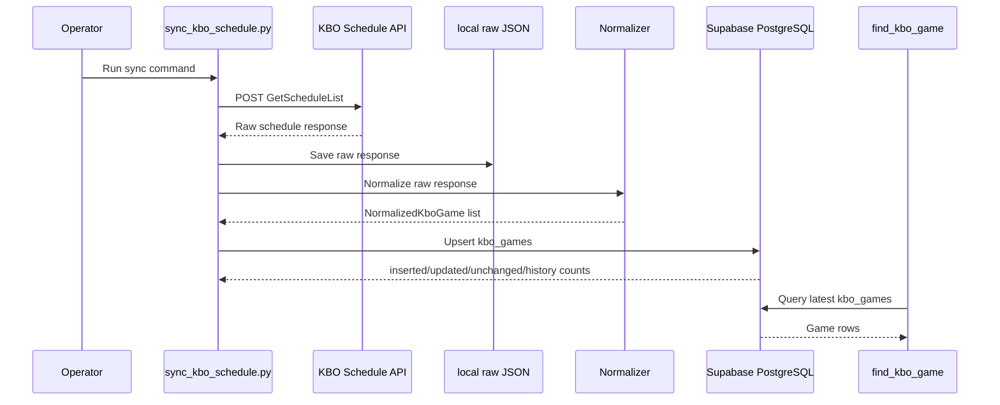

# KBO Schedule Sync Spec

> 라벨: `MVP2-3.1`
> 작성일: 2026-09-04
> 범위: KBO 공식 일정 API 수집, raw 로컬 저장, 정규화, `kbo_games` upsert, `find_kbo_game` 최신 데이터 기반 조회
> 상태: 구현 전 spec

## 1. 목적

`find_kbo_game` Tool이 낡은 정적 일정 데이터가 아니라 최신 DB 데이터를 조회하도록 KBO 경기 일정과 상태를 수동 또는 스케줄러로 동기화한다.

1차 목표는 운영 DB에 raw snapshot 테이블을 추가하는 것이 아니라, KBO 공식 일정 API 응답을 로컬 파일로 저장하고 이를 정규화해 기존 `kbo_games` upsert 흐름에 연결하는 것이다.

## 2. 현재 구현 범위

- [확인됨] `find_kbo_game`은 KBO 사이트를 실시간 호출하지 않고 DB의 `kbo_games`를 조회한다.
  - `backend/app/domains/baseball/tool/find_kbo_game/handler.py`
  - `backend/app/domains/baseball/service/services.py`
  - `backend/app/domains/baseball/infrastructure/repositories.py`
- [확인됨] 정규화된 JSON 파일을 읽어 `kbo_games`에 upsert하는 script가 있다.
  - `backend/scripts/import_kbo_schedule.py`
  - `backend/scripts/kbo_schedule_import/service.py`
  - `backend/scripts/kbo_schedule_import/loader.py`
- [확인됨] `internal_game_key` 기준 upsert와 더블헤더 key 생성 로직이 있다.
  - `backend/scripts/kbo_schedule_import/key_builder.py`
  - `backend/scripts/kbo_schedule_import/repository.py`
- [확인됨] `game_status`, `status_reason`, `away_score`, `home_score` 변경 시 `kbo_game_status_history`를 남기는 repository 로직이 있다.
  - `backend/scripts/kbo_schedule_import/repository.py`
- [확인됨] DB에는 `kbo_games`, `kbo_game_status_history` 테이블이 있다.
  - `supabase/migrations/20260727165538_create_kbo_schedule_tables.sql`
- [확인됨] 현재 migration에는 `kbo_schedule_raw_snapshots` 테이블이 없다.
  - `supabase/migrations/20260727165538_create_kbo_schedule_tables.sql`
- [확인됨] 로컬 raw/processed 데이터 폴더가 있다.
  - `data/kbo_schedule/raw/2026/*.json`
  - `data/kbo_schedule/processed/kbo_schedule_2026_normalized.json`
  - `data/kbo_schedule/README.md`

## 3. 비목표

- [확인됨] 이 단계에서는 RAG 검색 품질, embedding, citation, grounded answer 구조를 바꾸지 않는다.
- [확인됨] `find_kbo_game`의 조회 API 또는 Tool 입력 계약은 바꾸지 않는다.
- [확인됨] 1차 구현에서는 `kbo_schedule_raw_snapshots` DB 테이블을 만들지 않는다.
- [추론] raw 응답의 장기 감사 추적은 로컬 파일 저장 검증 이후 별도 단계에서 DB snapshot 테이블로 확장한다.
- [확인 필요] Render Cron Job 연결은 로컬 수동 sync가 안정화된 뒤 진행한다.

## 4. 사용자 흐름

이 기능은 일반 사용자가 직접 조작하는 화면 기능이 아니라 운영 데이터 동기화 작업이다.

운영자 또는 개발자는 CLI로 다음 흐름을 수행한다.

```text
특정 연도/월 sync 실행
→ KBO 공식 일정 API 응답 수집
→ raw JSON 로컬 저장
→ 정규화
→ dry-run이면 요약만 출력
→ 실제 실행이면 kbo_games upsert
→ inserted / updated / unchanged / status_history 출력
→ find_kbo_game은 최신 DB 조회
```

## 5. CLI 계약

새 CLI script를 추가한다.

```text
backend/scripts/sync_kbo_schedule.py
```

### 5.1 특정 월 sync

```bash
uv run python scripts/sync_kbo_schedule.py --season-year 2026 --month 09
```

동작:

```text
1. KBO 공식 일정 API에서 2026년 9월 데이터를 수집한다.
2. raw 응답을 data/kbo_schedule/raw/2026/09.json에 저장한다.
3. raw 응답을 normalized game 목록으로 변환한다.
4. normalized game을 internal_game_key 기반 upsert row로 변환한다.
5. DB에 upsert한다.
6. 결과 count를 출력한다.
```

### 5.2 오늘 경기만 sync

```bash
uv run python scripts/sync_kbo_schedule.py --today
```

동작:

```text
1. Asia/Seoul 기준 오늘 날짜를 구한다.
2. 오늘 날짜가 속한 season_year/month의 KBO 일정을 수집한다.
3. raw 응답은 해당 월 파일로 저장한다.
4. 정규화 후 오늘 날짜 경기만 필터링한다.
5. 오늘 경기만 DB에 upsert한다.
```

### 5.3 dry-run

```bash
uv run python scripts/sync_kbo_schedule.py --season-year 2026 --month 09 --dry-run
uv run python scripts/sync_kbo_schedule.py --today --dry-run
```

동작:

```text
1. KBO API 호출과 정규화는 수행한다.
2. raw 파일 저장은 기본적으로 수행한다.
3. DB write는 수행하지 않는다.
4. parsed_games, target_games, first_internal_game_key 등 확인 가능한 요약을 출력한다.
```

### 5.4 raw 저장 경로

1차 구현에서는 raw 응답을 로컬 파일로 저장한다.

```text
data/kbo_schedule/raw/<season_year>/<month>.json
```

예:

```text
data/kbo_schedule/raw/2026/09.json
```

저장 형식은 KBO API 응답 원문을 최대한 보존하되, 재현 가능한 처리를 위해 요청 정보와 수집 시각을 함께 둔다.

```json
{
  "source_name": "KBO Schedule.asmx/GetScheduleList",
  "source_url": "https://www.koreabaseball.com/Schedule/Schedule.aspx",
  "endpoint": "https://www.koreabaseball.com/ws/Schedule.asmx/GetScheduleList",
  "request_params": {
    "leId": "1",
    "srIdList": "0,9,6",
    "seasonId": "2026",
    "gameMonth": "09",
    "teamId": ""
  },
  "collected_at": "2026-09-04T00:00:00+09:00",
  "response_json": {}
}
```

## 6. 외부 API 계약

[확인됨] 계획 문서에 따르면 KBO 경기일정/결과 페이지는 내부 HTTP 요청으로 일정 데이터를 가져온다.

```text
POST https://www.koreabaseball.com/ws/Schedule.asmx/GetScheduleList
```

요청 파라미터:

```text
leId=1
srIdList=0,9,6
seasonId=<season_year>
gameMonth=<MM>
teamId=
```

[확인됨] 응답은 완전한 도메인 JSON이 아니라 KBO 표 렌더링용 JSON이며, 일부 경기 정보는 `Text` 필드의 HTML 조각 안에 들어 있다.

근거:

- `docs/planning/game-schedule/001-data-collection-and-db.md`
- `data/kbo_schedule/raw/2026/*.json`

## 7. 데이터 모델과 상태

### 7.1 NormalizedKboGame

[확인됨] 기존 import DTO는 다음 필드를 사용한다.

```text
source
source_url
collected_at
source_game_id
game_date
start_time
starts_at
away_team_name
away_team_id
home_team_name
home_team_id
away_score
home_score
stadium_name
stadium_id
game_status
status_reason
```

근거:

- `backend/scripts/kbo_schedule_import/dto.py`

### 7.2 kbo_games

[확인됨] `kbo_games`는 `find_kbo_game` 조회의 핵심 테이블이다.

주요 컬럼:

```text
season_year
source_game_id
internal_game_key
game_date
start_time
starts_at
away_team_id
home_team_id
stadium_id
away_team_name
home_team_name
stadium_name
game_status
status_reason
away_score
home_score
source_name
source_url
source_collected_at
```

근거:

- `backend/app/domains/baseball/infrastructure/models.py`
- `supabase/migrations/20260727165538_create_kbo_schedule_tables.sql`

### 7.3 kbo_game_status_history

[확인됨] 상태와 스코어 변경 이력을 저장한다.

기록 조건:

```text
game_status 변경
status_reason 변경
away_score 변경
home_score 변경
```

근거:

- `backend/scripts/kbo_schedule_import/repository.py`

## 8. 처리 흐름



## 9. Upsert와 count 정책

기존 repository를 재사용하되, 운영 로그로 해석 가능한 count 의미를 다음과 같이 고정한다.

```text
inserted_count:
  새 internal_game_key로 생성된 경기 수

updated_count:
  기존 경기 중 source_collected_at을 제외한 실질 필드 값이 변경된 경기 수

unchanged_count:
  기존 경기 중 source_collected_at 외에는 실질 변경이 없는 경기 수

status_history_count:
  game_status, status_reason, away_score, home_score 중 하나 이상 바뀌어 history row가 생성된 수
```

[확인됨] 현재 repository는 기존 row가 있으면 `updated_count`를 증가시키고, 변경이 없으면 `unchanged_count`도 증가시킨다. 따라서 구현 시 위 count 정책에 맞게 조정이 필요하다.

근거:

- `backend/scripts/kbo_schedule_import/repository.py`

## 10. 엣지 케이스와 실패 시나리오

- [확인됨] `source_game_id`는 nullable이며, 단독 upsert 기준으로 쓰지 않는다.
- [확인됨] 내부 upsert 기준은 `internal_game_key`다.
- [확인됨] 같은 날짜, 팀, 구장 조합이 중복되면 시작 시각과 순번을 붙여 더블헤더를 구분한다.
- [확인됨] `game_status`는 `scheduled`, `in_progress`, `completed`, `cancelled`, `postponed`, `unknown` 중 하나여야 한다.
- [확인됨] `completed`, `in_progress` 상태는 away/home score가 모두 있어야 DB check constraint를 통과한다.
- [확인 필요] KBO 응답 구조가 변경될 때 normalizer가 실패할지, 일부 필드만 `unknown`으로 보존할지 정책 결정이 필요하다.
- [확인됨] 1차 구현에서는 `우천취소`만 `cancelled`로 매핑하고, `그라운드사정`처럼 스코어 없는 다른 사유는 기존 샘플과 맞춰 `scheduled`로 두되 `status_reason`에 원문을 보존한다.

## 11. 테스트와 검증

### 11.1 자동 테스트 후보

1차 구현 시 다음 테스트를 추가한다.

```text
normalizer:
  KBO raw sample을 NormalizedKboGame 목록으로 변환한다.

raw storage:
  수집 응답을 data/kbo_schedule/raw/<year>/<month>.json 형식으로 저장한다.

today filter:
  Asia/Seoul 기준 오늘 날짜 경기만 target_games로 남긴다.

repository count:
  insert / real update / unchanged / status_history count 의미를 검증한다.

dry-run:
  DB write 없이 parsed_games, target_games, upsert_rows를 출력한다.
```

### 11.2 수동 검증 명령

특정 월 dry-run:

```bash
cd backend
uv run python scripts/sync_kbo_schedule.py --season-year 2026 --month 09 --dry-run
```

오늘 경기 dry-run:

```bash
cd backend
uv run python scripts/sync_kbo_schedule.py --today --dry-run
```

특정 월 실제 sync:

```bash
cd backend
uv run python scripts/sync_kbo_schedule.py --season-year 2026 --month 09
```

오늘 경기 실제 sync:

```bash
cd backend
uv run python scripts/sync_kbo_schedule.py --today
```

DB 확인은 로컬 Supabase가 실행 중일 때 수행한다.

```sql
select count(*) from public.kbo_games;

select game_status, count(*)
from public.kbo_games
group by game_status
order by game_status;

select max(source_collected_at)
from public.kbo_games;

select count(*)
from public.kbo_game_status_history;
```

## 12. 로깅과 디버깅

CLI는 최소한 다음 정보를 표준 출력으로 남긴다.

```text
mode=month|today
season_year=<year>
month=<MM>
dry_run=true|false
raw_file=<path>
parsed_games=<count>
target_games=<count>
upsert_rows=<count>
inserted=<count>
updated=<count>
unchanged=<count>
status_history=<count>
```

오류 발생 시에는 다음 구분이 가능해야 한다.

```text
KBO API 요청 실패
raw 파일 저장 실패
raw 응답 schema/HTML 파싱 실패
정규화 값 검증 실패
DB upsert 실패
```

## 13. 스케줄러 연결

[추론] 로컬 수동 sync와 dry-run이 안정화된 뒤 Render Cron Job 또는 동등한 스케줄러에 다음 작업을 연결한다.

후보:

```text
매일 12:00 Asia/Seoul:
  uv run python scripts/sync_kbo_schedule.py --today

매일 새벽 1회:
  uv run python scripts/sync_kbo_schedule.py --season-year <current_year> --month <current_month>
```

[확인 필요] Render 환경에서 `data/kbo_schedule/raw` 파일이 영구 보존되지 않을 수 있으므로, 운영 raw 장기 보관이 필요하면 DB snapshot 테이블 또는 외부 storage를 별도 도입한다.

## 14. 미완성/개선 후보

- KBO raw snapshot DB 테이블 추가
- raw response hash 기반 중복 snapshot 감지
- 특정 기간 sync 옵션 추가
- 시즌 전체 월별 sync 옵션 추가
- `find_kbo_game` 응답에 데이터 최신성 경고 추가
- status mapping fixture 확장
- Render Cron Job 실행 로그 보존 정책 정리
- 운영 장애 시 마지막 성공 sync 시각 확인용 lightweight health check 추가

## 15. 열린 질문

- KBO 응답 파싱 실패 시 전체 sync를 실패시킬지, 파싱 가능한 경기만 반영할지 결정이 필요하다.
- `그라운드사정` 등 모호한 원본 상태 사유를 계속 `scheduled`로 둘지, 별도 상태로 재분류할지 추가 샘플로 확정해야 한다.
- 운영 배포 후 raw 응답을 로컬 파일만으로 충분히 볼지, DB snapshot 또는 외부 storage로 옮길지 결정해야 한다.
